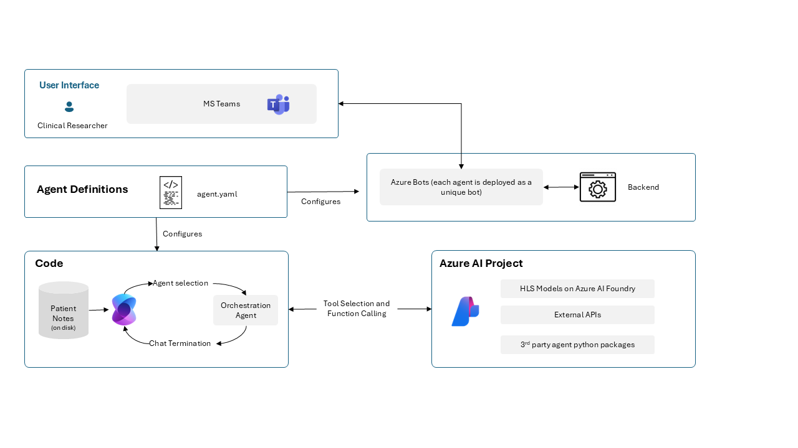

# Healthcare Agent Orchestrator
Healthcare Agent Orchestrator is a multi-agent accelerator that coordinates modular specialized agents across diverse data types and tools like M365 and Teams to assist multi-disciplinary healthcare workflows—such as cancer care. 

This repository contains comprehensive information to help you get started.

> [!IMPORTANT]
Healthcare Agent Orchestrator is a code sample to help you build an agent intended for research and development use only. Healthcare Agent Orchestrator is not designed or intended to be deployed in clinical settings as-is nor is it intended for use in the diagnosis or treatment of any health or medical condition, and its performance for such purposes has not been established. By using the Healthcare Agent Orchestrator sample, you are acknowledging that you bear sole responsibility and liability for any use of Healthcare Agent Orchestrator, including verification of outputs and incorporation into any product or service intended for a medical purpose or to inform clinical decision-making, compliance with applicable healthcare laws and regulations, and obtaining any necessary clearances or approvals.

## Features

- Demonstrates the use of the Healthcare Agent Orchestrator for solving complex tasks.
- Facilitates modular and scalable agent-based solutions for diverse healthcare needs.
- Provides tools for creating and managing specialized agents for specific tasks.
- Showcases the application of multi-model AI in healthcare scenarios.
- Supports adding your own data for agents to process and analyze.
- Integrates with Copilot Studio through Microsoft Cloud for Healthcare.
- Enables integration with Microsoft Teams for collaborative workflows.
- Highlights interoperability with Azure services and AI models such as [CxrReportGen](https://ai.azure.com/explore/models/CxrReportGen/version/7/registry/azureml).

## Solution Architecture


For each agent defined in `agents.yaml`, an Azure bot and associated Teams app are created. These are integrated into Semantic Kernel's group chat feature, allowing a group of experts to collaboratively solve tasks. Each agent has access to a set of tools. New agents can be added by updating `agents.yaml` and redeploying the application.

## AI Agent Role Summaries

- Orchestrator: Facilitates the conversation between the user and all expert agents. Determines the order of responses, gathers required information, and ensures agents yield control back after completing their tasks.
- Patient History: Loads and presents the patient's full clinical timeline using structured data tools. Answers questions about medical history but does not interpret images or make clinical recommendations.
- Radiology: Analyzes chest x-ray images using the CXRReportGen model and compares findings to the patient's history. Does not support other imaging modalities like CT or pathology.
- Patient Status: Provides a structured summary of the patient’s current clinical status including stage, biomarkers, and performance score. Requests missing details from PatientHistory if needed.
- Clinical Guidelines: Generates a structured treatment plan based on patient status using clinical guidelines and biomarker rationale. Recommends therapy adjustments and progression contingencies.
- Report Creation: Compiles a comprehensive tumor board Word document using all previously gathered information. Does not summarize or interpret; simply assembles validated agent outputs.
- Clinical Trials: Searches for and presents relevant clinical trials based on patient characteristics and prior treatments. Filters only for trials the patient is eligible for and formats them clearly.
- Medical Research: Retrieves research-backed insights using Microsoft GraphRAG. Responses include unaltered source references and links, focusing strictly on verified data.

## Getting Started

To get started with using our code sample for multi-agent workflows, follow the instructions below to set up your environment and run the sample application.

### Prerequisites

> [!IMPORTANT]
> Follow the steps in order. Each step builds on the previous ones, and jumping ahead may require restarting deployments that can take significant time to complete. Detailed documentation is linked for each step if you need additional context.

- An Azure subscription with:
    - Azure OpenAI: 100k Tokens per Minute of Pay-as-you-go quota for GPT-4o or GPT-4.1
    - Optionally access to a reasoner model such as GPT-o3-mini
    - GPU resources for one of the following:
        - NCADSA100v4 Family: 24 cores (one instance of Standard_NC24ads_A100_v4), or
        - NCADSH100v5 Family: 40 cores (one instance of Standard_NC40ads_H100_v5)
    - Azure App Services: Available VM quota - P1mv3 recommended
    - A resource group where you have _Owner_ permissions for deployment (subscription- level owner permissions is OK too)
- [Azure CLI](https://learn.microsoft.com/en-us/cli/azure/install-azure-cli)
- [Azure Developer CLI](https://learn.microsoft.com/en-us/azure/developer/azure-developer-cli/install-azd?tabs=winget-windows%2Cbrew-mac%2Cscript-linux&pivots=os-linux)
- Python 3.12 or later (for running locally)

### Step 1: Verify Prerequisites (Quota & Permissions)

Before deploying, verify your Azure subscription has sufficient quota and your account has the necessary permissions to avoid resource limitations during deployment.

**Resource Requirements:**

* **Azure OpenAI and GPU Quota**
  - Ensure you have quota for either **GPT-4o** or **GPT-4.1** models (`GlobalStandard`) in your `AZURE_GPT_LOCATION` region (recommended: 100K-200K TPM)
  - Confirm availability of at least **24 cores** of NCADSA100v4 for `Standard_NC24ads_A100_v4` VM or **40 cores** of NCADSH100v5 for `Standard_NC40ads_H100_v5` VM in your `AZURE_HLS_LOCATION` region
  - The [Azure AI Management Center](https://ai.azure.com/managementCenter/quota) is a helpful tool for this.
  - When using Azure ML, you need adequate capacity in your Azure Machine Learning Compute, which is separate from and managed independently of your subscription GPU quota. Refer to [Manage resources and quotas - Azure Machine Learning | Microsoft Learn](https://docs.microsoft.com/en-us/azure/machine-learning/how-to-manage-quotas) for more details.

* **App Service Capacity**
  - Verify App Service quota in your `AZURE_APPSERVICE_LOCATION` region:
    ```sh
    az quota list --scope /subscriptions/<subscription-id>/providers/Microsoft.Web/locations/<region> --output table --query "[].{Name:properties.name.localizedValue, Quota:properties.limit.value, Unit:properties.unit}"
    ```
  - Ensure sufficient capacity for P1mv3 App Service Plan
  - Note: Quota displays show limits only, not current usage. Check existing deployments to confirm available capacity.

**Required Permissions:**

* **Azure Resource Access**
  - You need **Owner** rights on at least one resource group
  - If you lack subscription-level owner permissions, ask your IT administrator to:
    - Create a resource group for you
    - Grant you the **Owner** role on that specific resource group
    - Use that resource group in **Step 3**.

* **Teams Integration**
  - Ensure your IT admin allows custom Teams apps to be uploaded—see [Teams app upload](https://learn.microsoft.com/en-us/microsoftteams/platform/concepts/deploy-and-publish/apps-upload)


### Step 2: Create an `azd` Environment & Set Variables

Now use the region values you identified in [Step 1](#step-1-verify-prerequisites-quota--permissions) where you confirmed quota availability.

If you've identified single region for deployment, you can proceed to authentication. Otherwise, use the following table to set locations where you have quota/capacity available.

| Variable | Purpose | Default Value |
|----------|---------|---------------|
| AZURE_LOCATION | Primary location for all resources | Defaults to resource group region |
| AZURE_HLS_LOCATION | Region for GPU resources | Defaults to `AZURE_LOCATION` |
| AZURE_GPT_LOCATION | Region for GPT resources | Defaults to `AZURE_LOCATION` |
| AZURE_APPSERVICE_LOCATION | Region for App Service deployment | Defaults to `AZURE_LOCATION` |
| GPU_INSTANCE_TYPE | GPU SKU for model deployment | Defaults to `Standard_NC24ads_A100_v4` |
| CLINICAL_NOTES_SOURCE | Source of clinical notes used by agents. Accepted values: `blob`, `fhir`, `fabric`. | Defaults to `blob` |
| ADDITIONAL_ALLOWED_IPS | Additional IP addresses/ranges for App Service access (comma-separated string format) | Defaults to empty string |
| ADDITIONAL_ALLOWED_TENANT_IDS | Tenant IDs allowed to access agents (See [Access Control](docs/access_control.md)) | Defaults to "*"
| ADDITIONAL_ALLOWED_USER_IDS | User IDs allowed to access agents (See [Access Control](docs/access_control.md)) | Defaults to "*"

First, authenticate with Azure services:
```sh
# Log in to Azure CLI and Azure Developer CLI
az login                 # add -t <TENANT_ID> if needed
azd auth login           # add --tenant <TENANT_ID> if needed
```

Create a new environment with a short name:
```sh
# Create environment (keep name ≤ 8 characters for best results)
azd env new <envName>
```

Configure region settings (only set values that differ from your main `AZURE_LOCATION`):

```sh
# Configure specific regions where you have quota (only needed if different from AZURE_LOCATION)
azd env set AZURE_HLS_LOCATION <hls-region>
azd env set AZURE_GPT_LOCATION <gpt-region>
azd env set AZURE_APPSERVICE_LOCATION <region>

# Override GPU instance type (only needed if not using the default Standard_NC24ads_A100_v4)
azd env set GPU_INSTANCE_TYPE Standard_NC40ads_H100_v5

# Allow additional IP addresses for App Service access (for development/debugging)
azd env set ADDITIONAL_ALLOWED_IPS "203.0.113.100/32,198.51.100.0/24"
```

[OPTIONAL] Agents can be configured to have a different data access layer. This repo provides two alternatives for retrieving clinical notes using the Fast Healthcare Interopability Resource (FHIR) standard. The first option leverages the FHIR server from Azure Health Data Services (AHDS), more information can be found [here](./docs/fhir_integration.md). The second alternative uses a relational FHIR server as part of healthcare data solutions (HDS) in Microsoft Fabric, more information can be found [here](./docs/fabric/fabric_integration.md).

```sh
azd env set CLINICAL_NOTES_SOURCE fhir
```

> [!NOTE] 
> If you want to setup the research agent with Graph Rag, see more information in the [User Guide](./docs/user_guide.md#configuring-research-agent)

### Step 3: Deploy the Infrastructure

Now that your environment is set up, you can deploy all the necessary resources and infrastructure for the Healthcare Agent Orchestrator. 

> [!IMPORTANT]
> Deploying the infrastructure will create Azure resources in your subscription and may incur costs.

> [!CAUTION]  
> Ensure you have completed **Step&nbsp;1** and **Step&nbsp;2** before you proceed. Deploying the infrastructure can take a long time, and fixing errors after an incomplete or failed deployment is often even more time-consuming. Double-check your quotas, permissions, and environment variables now to avoid lengthy troubleshooting later.

To start the deployment process, run:

```bash
azd up
```

During deployment you will be prompted for the following information if not provided in the environment:

- You’ll be prompted for subscription, region, and resource group.  
- Pick **User** as the principal type.  
- Quota tip: 100 tokens/min is enough; 200 gives faster responses.

This command will provision all required Azure resources according to your environment settings, deploy the application code, and configure the necessary connections between components.

> [!TIP]
> For persistent deployment issues, use `azd down --purge` to completely reset your environment and avoid complications from Azure's soft-delete behavior by manually deleting the resource group.

> [!IMPORTANT]
> The full deployment can take 20-30 minutes to complete. If you encounter any issues during the deployment process, see the [Troubleshooting guide](./docs/troubleshooting.md#deploy-the-infrastructure) for common deployment problems and solutions.

### Step 4: Install the Agents in Microsoft Teams

Now that your infrastructure is deployed, you need to install the agents in Microsoft Teams to interact with them:

For bash users:
```sh
# From repo root
./scripts/uploadPackage.sh ./output <teamsChatId|meetingLink> [tenantId]
```

For PowerShell users:
```powershell
# From repo root
.\scripts\uploadPackage.ps1 -directory ./output -chatOrMeeting <teamsChatId|meetingLink> [-tenantId <tenant-id>] 
```

During this process:
- You'll need a Teams **chat ID** or meeting link where the agents will be installed
- To get a chat ID, follow the instructions in [docs/teams.md#get-chat-id](./docs/teams.md#get-chat-id)


> [!TIP] 
> See the [Teams documentation](./docs/teams.md) for detailed instructions on finding chat IDs, creating Teams meetings for agents, and managing agent permissions within your Microsoft Teams environment.

> [!TIP] 
> If you encounter errors during agent installation or Teams integration, check the [Troubleshooting guide](./docs/troubleshooting.md#install-the-agents-in-microsoft-teams) for common issues and solutions related to package uploads, permissions, and Teams app installation.


### Step 5: Test the Agents inside Teams

See the [User Guide](./docs/user_guide.md) for a more complete guide, the most important commands are:
```
@Orchestrator clear                  # Reset conversation state
```

To start a tumor board review, try:
```
@Orchestrator Can you start a tumor board review for Patient ID: patient_4?
``` 

You can interact with any of the agents:
```
@PatientHistory create patient timeline for patient id patient_4
@PatientHistory can you tell me more about when chemotherapy happened relative to the KRAS mutation?
```

> [!TIP] 
> For detailed instructions on testing agents with sample scenarios and troubleshooting tips, see the [User Guide](./docs/user_guide.md).

### Step 6: Using the React Client Application

As part of the deployment, a simple chat UI was also deployed. You can access it using the url that showed up after doing azd up in step 3.

> [!NOTE] 
> By default, the chat application is only accessible from Microsoft 365/Teams IP ranges for security. If you need to access the web UI directly from your development machine, you'll need to add your IP address to the allowed list using:
> ```sh
> azd env set ADDITIONAL_ALLOWED_IPS "your.ip.address/32"
> azd up
> ```
> **Important**: You need to add your own IP address if you want to access grounded links and generated Word documents from the healthcare agents.
> 
> For more information on network security configuration, see the [Network Architecture](./docs/network.md) documentation.

### [Optional] Uninstall / Clean-up

To completely remove all deployed resources and clean up your environment, run:

```sh
azd down --purge
```

This command will permanently delete all Azure resources created during deployment, including resource groups, managed identities, storage accounts, endpoints, and other associated services.

## See Also
- [Healthcare Model Studio](https://aka.ms/healthcaremodelstudio) - AI Foundry Healthcare Model Catalog.
- [CXRReportGen Model Card](https://aka.ms/cxrreportgenmodelcard) - Model card for CXRReportGen, a chest X-ray report generation model.
- [MedImageParse Model Card](https://aka.ms/medimageparsemodelcard) - Model card for MedImageParse a model for medical image segmentation.
- [MedImageInsight Model Card](https://aka.ms/mi2modelcard) - Model card for MedImageInsight, an image and test embedding foundation model.
- [Healthcare AI Code Examples](https://github.com/microsoft/healthcareai-examples) - A collection of code samples, templates of use cases for healthcare foundation models, providing practical examples for medical imaging and other healthcare AI applications.

## Resources

### Features Documentation

- [User Guide](./docs/user_guide.md) and [Documentation Index](docs/README.md)
- [Agent Development Guide](./docs/agent_development.md) for building modular solutions
- [Tool Integration Guide](./docs/agent_development.md#adding-tools-plugins-to-your-agents)
- [Healthcare Scenarios Guide](./docs/scenarios.md) for implementation examples
- [Data Ingestion Guide](./docs/data_ingestion.md) for adding custom data
- [Network Architecture](./docs/network.md) for network configuration and security
- [Microsoft Cloud for Healthcare Integration](./docs/mcp.md)
- [Teams Integration Guide](./docs/teams.md)


### External Documentation

- [Getting started with Azure OpenAI Assistants (Preview)](https://learn.microsoft.com/en-us/azure/ai-services/openai/how-to/assistant)
- [Azure OpenAI Service](https://learn.microsoft.com/azure/ai-services/openai/overview)
- [Generative AI For Beginners](https://github.com/microsoft/generative-ai-for-beginners)
- [Foundation models for healthcare AI](https://learn.microsoft.com/en-us/azure/ai-studio/how-to/healthcare-ai/healthcare-ai-models)
- [Introduction to Semantic Kernel](https://learn.microsoft.com/en-us/semantic-kernel/overview/)
- [What is the Bot Framework SDK?
](https://learn.microsoft.com/en-us/azure/bot-service/bot-service-overview?view=azure-bot-service-4.0)

## Guidance

Running through the installation will deploy:
- 1 [Azure AI Online endpoints](https://learn.microsoft.com/en-us/azure/machine-learning/concept-endpoints-online?view=azureml-api-2)
- 1 [GPT-4o deployment](https://learn.microsoft.com/en-us/azure/ai-services/openai/concepts/models?tabs=global-standard%2Cstandard-chat-completions#gpt-4o-and-gpt-4-turbo)
- 1 [App Service](https://learn.microsoft.com/en-us/azure/app-service/overview)
- 2 [Azure Storage account](https://learn.microsoft.com/en-us/azure/storage/common/storage-account-overview)
- associated [managed identities](https://learn.microsoft.com/en-us/entra/identity/managed-identities-azure-resources/overview) and [azure bot](https://learn.microsoft.com/en-us/azure/bot-service/bot-service-overview?view=azure-bot-service-4.0) instances

### Security

All resources within this template use Entra Id authentication. No passwords are stored anywhere. 
Be advised that the web app does expose a public unauthenticated endpoint and that the files you put under infra/patient_data will be publicly available.

### Additional Guidance

For detailed guidance, refer to the [User Guide](./docs/user_guide.md):

- [Technical Limitations](./docs/user_guide.md#technical-limitations): Understand constraints around agent coordination, image processing, and context management.
- [Performance Assessments and Evaluations](./docs/user_guide.md#performance-assessments-and-evaluations): Review how the framework was assessed using metrics like response accuracy and task completion rates.

These sections help set appropriate expectations for real-world healthcare implementations.

## Ethical Considerations
Microsoft believes Responsible AI is a shared responsibility and we have identified six principles and practices that help organizations address risks, innovate, and create value: fairness, reliability and safety, privacy and security, inclusiveness, transparency, and accountability. When downloaded or used in accordance with our terms of service, developers should work with their supporting model team to ensure this model meets requirements for the relevant use case and addresses unforeseen product misuse. 
While testing the agents and models with images and/or text, ensure the data is has no PHI/PII and that there is no patient information or information that can be traced to a patient identity.
Please see Microsoft's Responsible AI Principles and approach available at https://www.microsoft.com/en-us/ai/principles-and-approach/

## Authorized Use

This project may contain trademarks or logos for projects, products, or services. Authorized use of Microsoft trademarks or logos is subject to and must follow [Microsoft's Trademark & Brand Guidelines](https://www.microsoft.com/en-us/legal/intellectualproperty/trademarks/usage/general). Use of Microsoft trademarks or logos in modified versions of this project must not cause confusion or imply Microsoft sponsorship. Any use of third-party trademarks or logos are subject to those third-party's policies.

## Contact Us

For questions or inquiries into our products, please contact us at hlsfrontierteam@microsoft.com

### Issues and Support

If you encounter any issues or bugs, please create a [GitHub issue](https://github.com/Azure-Samples/healthcare-agent-orchestrator/issues) with details about the problem and steps to reproduce it.
For security issues, see [Reporting Security Issues](./SECURITY.md)

### How to Contribute

We welcome contributions to improve this project! Please see our [Contribution Guide](./CONTRIBUTING.md) for information on how to get started with contributing code, documentation, or other improvements. Most contributions require you to agree to a Contributor License Agreement (CLA) declaring that you have the right to, and actually do, grant us the rights to use your contribution. For details, visit <https://cla.opensource.microsoft.com>

When you submit a pull request, a CLA bot will automatically determine whether you need to provide a CLA and decorate the PR appropriately (e.g., status check, comment). Simply follow the instructions provided by the bot. You will only need to do this once across all repos using our CLA.

This project has adopted the [Microsoft Open Source Code of Conduct](https://opensource.microsoft.com/codeofconduct/). For more information see the [Code of Conduct FAQ](https://opensource.microsoft.com/codeofconduct/faq) or contact <opencode@microsoft.com> with any additional questions or comments.

