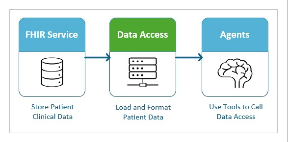

# EHR Integration via HL7® FHIR

This user guide provides instructions for integrating AI agents with an EHR via HL7® FHIR (Fast Healthcare Interoperability Resources) to enable the retrieval of clinical notes. The sample code includes support for a `CLINICAL_NOTES_SOURCE` environment variable, which can be set to activate FHIR service integration. When this integration is enabled, an Azure Healthcare Data Services (AHDS) FHIR service instance will be automatically deployed within your resource group, and sample patient data `patient_4` will be uploaded to the service. With this configuration, the deployed agents will retrieve clinical notes directly from the FHIR service rather than from blob storage, ensuring a more streamlined and standardized access to patient information. The guide also includes practical examples and configurations to help you connect agents to your EHR systems.

## Overview


The dataflow for integrating AI agents with a FHIR service to retrieve clinical notes involves several key components working together. When a clinical note is needed, the agent utilizes tools to make a request for data through the Data Access module. The Data Access module then communicates with the FHIR server, issuing a query for clinical notes associated with a specific patient ID. Upon receiving the request, the FHIR server processes the query and returns the relevant clinical notes to the Data Access module. These notes are then provided back to the agent, enabling it to use the clinical information as needed. This structured dataflow ensures efficient, secure, and standardized retrieval of patient clinical notes into the AI agent’s workflow.

## Data Access

This code sample includes a sample implementation of a FHIR service client named [FhirClinicalNoteAccessor](../src/data_models/fhir/fhir_clinical_note_accessor.py). The [FhirClinicalNoteAccessor](../src/data_models/fhir/fhir_clinical_note_accessor.py) module demonstrates how to connect to a FHIR service and retrieve patient clinical data, specifically clinical notes. Key features of this module include:  
   
- **Authentication Examples:** Step-by-step examples showing how to authenticate requests to the FHIR service using various methods.  
- **Querying Clinical Notes by Patient ID:** Example queries for retrieving clinical notes associated with a specific patient ID from the FHIR service.  
   
This module serves as a practical starting point for developers who want to integrate with their EHR system.

### Authenticating to the FHIR service

The sample code in this guide demonstrates how to deploy an instance of the AHDS FHIR service and connect to it securely. The FHIR service supports OAuth2 for authentication, ensuring authorized access to healthcare data. The sample code provides two methods for authenticating with the FHIR service:  

- **Managed Identity Authentication**: Use Azure managed identities to access the FHIR service without managing credentials. This is the authentication method configured by default.
- **Client Secret Authentication**: Connect to the FHIR service using a client ID and client secret from a registered Azure Active Directory application.  

If you would like to change the authentication method in use or implement your own, review the code in [FhirClinicalNoteAccessor](../src/data_models/fhir/fhir_clinical_note_accessor.py) and you will see two static factory functions that return an instance of the **FhirClinicalNoteAccessor** class with the authentication method configured. To change which authentication method is used, you can edit [DataAccess](../src/data_models/data_access.py) and modify the [`create_data_access()`](https://github.com/Azure-Samples/healthcare-agent-orchestrator/blob/ece9cb9bfb45ec88db9559bc9280f27ada054d17/src/data_models/data_access.py#L92) function accordingly. For example, to change the authentication to use a client secret, you would change the instansiation of **FhirClinicalNoteAccessor** from using [`FhirClinicalNoteAccessor.from_credential()`](https://github.com/Azure-Samples/healthcare-agent-orchestrator/blob/ece9cb9bfb45ec88db9559bc9280f27ada054d17/src/data_models/fhir/fhir_clinical_note_accessor.py#L21) to use the [`FhirClinicalNoteAccessor.from_client_secret()`](https://github.com/Azure-Samples/healthcare-agent-orchestrator/blob/ece9cb9bfb45ec88db9559bc9280f27ada054d17/src/data_models/fhir/fhir_clinical_note_accessor.py#L27) factory function as follows:
```python
...
    if clinical_notes_source == "fhir":
        # Note: You can change FhirClinicalNoteAccessor instantiation to use different authentication methods
        clinical_note_accessor = FhirClinicalNoteAccessor.from_client_secret(
            tenant_id=os.getenv("AZURE_TENANT_ID"),
            client_id=<insert-your-client-id-here>,
            client_secret=<insert-your-client-secret-here>,
            fhir_url=os.getenv("FHIR_SERVICE_ENDPOINT")
        )
    else:
...
```
It is straightforward to create additional authentication methods by creating new static factory functions in [FhirClinicalNoteAccessor](../src/data_models/fhir/fhir_clinical_note_accessor.py). A good exercise would be to add asymmetric (“private key JWT”) authentication as defined in the FHIR standard here: [Asymmetric (“private key JWT”) authentication](https://www.hl7.org/fhir/smart-app-launch/client-confidential-asymmetric.html)

### FHIR Resources and Queries
This code sample fetches patient demographic data from the **Patient** FHIR resource and clinical notes from the **DocumentReference** FHIR resource. You can see how they are queried in [FhirClinicalNoteAccessor](../src/data_models/fhir/fhir_clinical_note_accessor.py). If you want to take this example further and include data from different FHIR resources, you can update [`FhirClinicalNoteAccessor.read()`](https://github.com/Azure-Samples/healthcare-agent-orchestrator/blob/c9ddc8929f01b0344dee5259e8ea85efba2bb053/src/data_models/fhir/fhir_clinical_note_accessor.py#L171) and [`FhirClinicalNoteAccessor.read_all()`](https://github.com/Azure-Samples/healthcare-agent-orchestrator/blob/c9ddc8929f01b0344dee5259e8ea85efba2bb053/src/data_models/fhir/fhir_clinical_note_accessor.py#L193) with queries that are compatible with your data model.

## Connecting to your own FHIR Service
You can also modify this example to connect to your own instance of a FHIR service as follows:
```powershell
# Update CLINICAL_NOTES_SOURCE to FHIR
azd env set CLINICAL_NOTES_SOURCE fhir
# Update FHIR URL
azd env set FHIR_SERVICE_ENDPOINT "https://<insert-your-fhir-endpoint-here>"
# Start deployment
azd up
```
Note that you will need appropriate data in the repository behind your FHIR service that matches the pattern of this example for the demonstration to work well. You can see examples for how to upload patient information here: [Data Ingestion](../docs/data_ingestion.md)