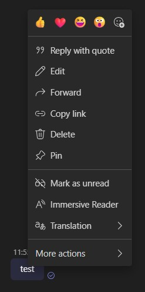

# Adding Agents to Microsoft Teams

## Add Agents to Chat

These instructions assume you have already deployed the infrastructure.

- [Manual Upload](#manual-upload-packages)
- [Automated Upload](#automated-upload-using-scripts)

### Manual Upload Packages

- Navigate to the `output` folder.
- For each zip file in the folder, upload it as a package to the Teams group chat or meeting.
    - Click on "Add People, Agents and Bots" next to the Join button on the top right of the chat window.
    - Click on "Add Agents and Bots"
    - Click on "Manage your apps"
    - Click on "Upload an app"
    - Select the zip file from the `output` folder and click "Open".
    - You should see an agent is added to the chat.

### Automated Upload Using Scripts

#### 1. Get the Teams Meeting Link or Chat ID

Before running the upload scripts, you'll need either the Teams meeting link or chat ID:

1. Right click on any message in the chat (send a test message if the chat is empty)
    
    

2. Click on **Copy Link**
3. Paste the copied link into any text editor. The link should look similar to:
    ```
    https://teams.microsoft.com/l/message/19:meeting_YTM0NzVkNGQtSTFhDC65PvNmLWI2ODUtZTY3YzRhOGJiZDNh@thread.v2/1746471311429?context=%7B%22contextType%22%3A%22chat%22%7D
    ```

4. You can use either:
    - The complete meeting link as shown above, OR
    - Just the chat ID portion: `19:meeting_YTM0NzVkNGQtSTFhDC65PvNmLWI2ODUtZTY3YzRhOGJiZDNh@thread.v2`

Both options are valid inputs for the `<teamsChatId|meetingLink>` parameter in the scripts below.

#### 2. Use the Upload Scripts with Your Chat ID

**PowerShell Script (Windows):**
- Ensure you have the [Az.Accounts](https://learn.microsoft.com/en-us/powershell/module/az.accounts/?view=azps-13.4.0) module installed.
- Run the following commands:
    ```powershell
    # From repo root
    Connect-AzAccount
    .\scripts\uploadPackage.ps1 -directory ./output -chatOrMeeting <teamsChatId|meetingLink> [-tenantId <tenant-id>] 
    ```

**Bash Script (Unix/Mac):**
- Ensure the Azure CLI is installed and authenticated.
- Run the following command:
    ```sh
    ./scripts/uploadPackage.sh ./output <teamsChatId|meetingLink> [tenantId]
    ```

**Known Issues (applies to both scripts):**
- If the Teams user is different from the user who deployed the application or resides in a different tenant, you may need to re-authenticate:
    ```sh
    az logout
    az login --allow-no-subscriptions
    ```
- If you encounter a login error requiring additional access, you can manually obtain an authentication token on an authorized computer with the necessary permissions:
    - PowerShell:
        ```powershell
        $authToken = (Get-AzAccessToken -ResourceUrl "https://teams.microsoft.com" -Tenant $tenant).Token
        $authToken="<access_token>"
        ```
    - Bash:
        ```sh
        authToken=$(az account get-access-token --resource "https://teams.microsoft.com" --tenant "$tenantId" --query accessToken -o tsv)
        authToken="<access_token>"
        ```

For more details on uploading custom apps in Teams, refer to the [app upload documentation](https://learn.microsoft.com/en-us/microsoftteams/platform/concepts/deploy-and-publish/apps-upload).

## Create Personal Chat

If you would like to start a personal chat (no invitees) with agents, follow these steps to create a personal chat in Teams:
- Click on Calendar
- Click on the `Meet now` button
- Enter the meeting name
- Click on the `Start meeting` button
- Click on the `Join now` button
- Close the `Invite people to join you` popup
- Click on the `Chat` button
- Send a `test` message
- Leave the meeting
- Follow [Add Agents to Chat](#add-agents-to-chat) to add agents to your personal chat.